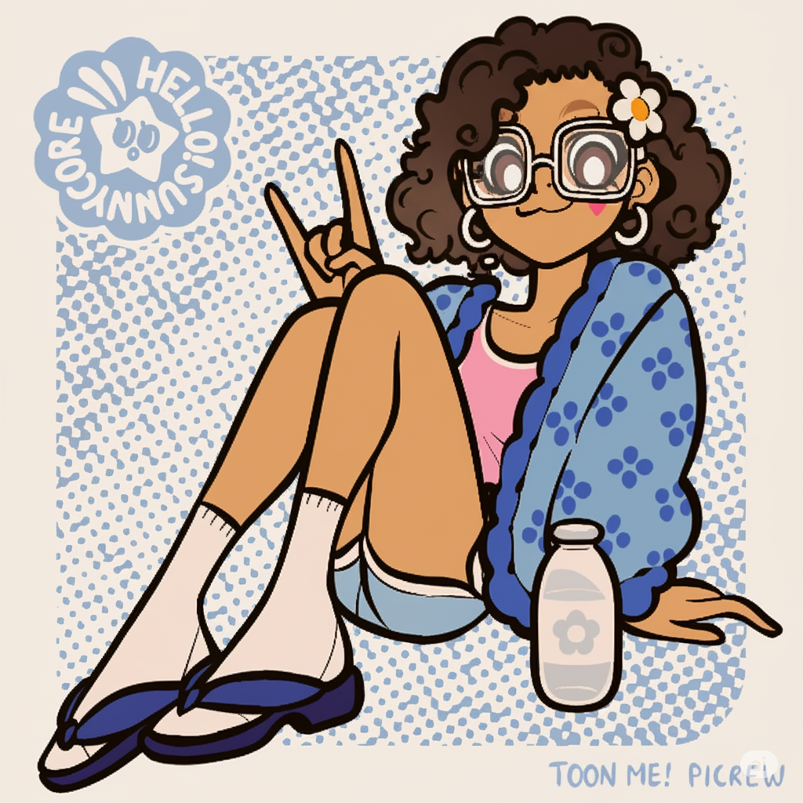

<!-- Título central com fundo rosa claro -->

  

<!-- Avatar -->

  

<h3 align="center"> 💡 Sobre mim </h3>

🌸 Me chamo **Julia**, mas aqui no GitHub sou conhecida como **@julinhaca**

🌸 Sou formada em Analise de Desenvolvimento de Sistema na faculdade anhanguera  

Também formada na escola CEEP Centro Estadual de Educaçao Profissional Predo Boartto Neto no curso de Informática em Cascavel - PR.   

Sempre gostei da área de informática, e a programação é onde eu mais gostei, pois algo que não tinha, com a programação é possível de ter usando a criatividade e estilo, além de problemas serem resolvidos com criatividade. 🌸  

🌸 Gosto sempre de me atualizar das coisas, pois problemas que eram resolvidos com um código agora são resolvidos com outro mais atualizado, criativo e ágil. Como os problemas nunca acabam, sempre aparece um novo, e com isso vêm novas soluções com criatividade, agilidade ou simplicidade. 🌸

---

### 🛠️ Linguagens que uso

  
  
  
  
  

---

### 📈 Minhas estatísticas

  
  

---

### 💻 Trabalho com desenvolvimento de sistemas web usando:

- 🧩 **PHP**
- 🛢️ **MySQL** e Banco de Dados
- 🎨 **HTML + CSS** com um toque especial de estilo
- ⚡ **JavaScript** para deixar tudo mais dinâmico!

📬 Email para contato: **juliacavalcante027@gmail.com**

<picture align="center">
  <source media="(prefers-color-scheme: dark)" srcset="https://raw.githubusercontent.com/julinhaca/julinhaca/output/github-contribution-grid-snake.svg">
  <source media="(prefers-color-scheme: light)" srcset="https://raw.githubusercontent.com/julinhaca/julinhaca/output/github-contribution-grid-snake.svg">
  
</picture>

---

### ✨ Um pouco sobre meu estilo

💖 Eu gosto de códigos organizados, com visual bonito e com carinho em cada detalhe  
💡 Acredito que tecnologia pode ser leve, acessível e criativa  
🌷 Sempre aprendendo, crescendo e programando com propósito

---

  

  Feito com 💕 por <strong>Julia (@julinhaca)</strong>

